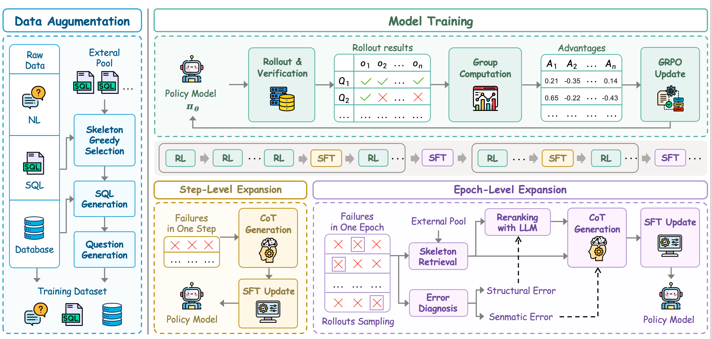

<h1 align="center">COAL-SQL: Coverage-Guided Augmentation and Failure-Driven Learning for Text-to-SQL Post-Training</h1>

COAL-SQL is a unified post-training framework for Text-to-SQL that combines **Co**verage-Guided **A**ugmentation with Failure-Driven **L**earning. It targets two complementary challenges in adapting open-source LLMs to a target Text-to-SQL task: (1) constructing training data that covers the SQL structures the task requires, and (2) enabling the model to actually acquire those capabilities during optimization.

## Overview



Effective Text-to-SQL post-training needs both adequate coverage of the SQL capabilities the target task requires and an optimization process that lets the model acquire them. COAL-SQL addresses these from the data and learning sides:

- **Coverage-Guided Augmentation** expands an existing seed set according to its structural coverage. It abstracts SQL queries into schema-independent *skeletons*, applies metric *K*-center selection with the seed skeletons fixed as existing centers to favor complementary structures, and instantiates the selected skeletons on the target training databases as verified question–SQL examples.

- **Failure-Driven Learning** supplements GRPO with supervision derived from *Solve-None* examples (those for which no sampled rollout is execution-correct). It uses step-level expansion to construct corrective chain-of-thought traces for newly observed failures, and epoch-level expansion to build structure-related practice from failures accumulated during training.

With only ~12.6K distinct post-training examples, COAL-SQL reaches 64.9% execution accuracy on the BIRD development set and outperforms comparable-scale baselines.

## Repository Structure

```
COAL-SQL/
├── core/                 # Shared utilities: LLM client, parallel helpers, SQL execution rewards
│   └── reward/           # Text-to-SQL execution/format reward functions
├── data_augmentation/    # Coverage-Guided Augmentation (skeleton pool, K-center selection, synthesis)
├── sql_retrieval/         # SQL skeleton retrieval infrastructure (skeleton extraction, FAISS index)
├── training/             # Failure-Driven Learning + GRPO training
│   └── verl/             # verl framework; our code lives in verl/verl/coalsql/
├── scripts/              # Training launch script (train_coalsql.sh)
├── figures/              # Figures used in this README
├── requirements.txt
└── setup.py
```

Module-level details:

- Data augmentation: [`data_augmentation/README.md`](data_augmentation/README.md)
- Skeleton retrieval: [`sql_retrieval/README.md`](sql_retrieval/README.md)

## 🚀 Installation

```bash
conda create -n coalsql python=3.10
conda activate coalsql

# COAL-SQL dependencies and package
pip install -r requirements.txt
pip install -e .

# verl training backend
cd training/verl
pip install -e .
cd ../..
```

If you run into issues installing `flash-attn`, install a prebuilt wheel that matches your CUDA/torch versions from the [flash-attention releases](https://github.com/Dao-AILab/flash-attention/releases).

### Configuration

Copy the environment template and fill in your paths:

```bash
cp .env.example .env
```

`.env` provides the model path, database directories used by the execution reward (`SQL_DATASET_DIR_DEV` / `SQL_DATASET_DIR_TRAIN` / `SQL_DATASET_DIR_QB`), the training result directory, and the LLM API used by error-aware retrieval.

## Usage

### 1. Data Preparation

COAL-SQL operates on a target Text-to-SQL task (e.g. BIRD) plus a **user-provided external SQL collection** that serves as the augmentation source. You need:

- A **seed training set** in parquet format (question, gold SQL, `db_id`), used for GRPO and as the reference for structural coverage.
- The associated **databases** (SQLite), used by the execution reward.
- An **external SQL collection** for augmentation. It can come from any Text-to-SQL corpus; each record needs at least an executable gold SQL (and optionally `db_id` / `question`). See [`sql_retrieval/README.md`](sql_retrieval/README.md) for the expected format.

COAL-SQL does not bundle any specific dataset; point the paths in `.env` and the scripts to your own data.

### 2. Coverage-Guided Augmentation

Build the skeleton retrieval index, then select complementary skeletons and synthesize verified examples with the one-shot pipeline script:

```bash
# Build skeleton pool + FAISS index + precomputed embeddings
bash sql_retrieval/run_preprocess.sh

# Select complementary skeletons and synthesize verified question-SQL pairs
bash data_augmentation/run_augmentation.sh
```

See [`data_augmentation/README.md`](data_augmentation/README.md) for the per-step breakdown and configurable options. The synthesized examples are merged with the seed set to form the final post-training data.

### 3. Training

Launch the full COAL-SQL run (Coverage-Guided Augmentation data + step-level and epoch-level Failure-Driven Learning):

```bash
bash scripts/train_coalsql.sh
```
